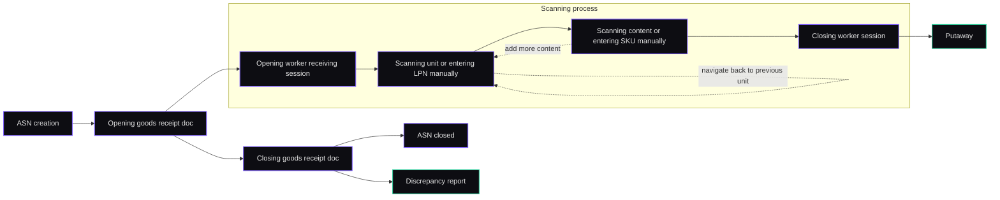

# Receiving Service

A microservice designed to handle the goods receiving process in a warehouse management system (WMS).

## Table of Contents

- [Core Business Process](#core-business-process)
- [Domain Model](#domain-model)
- [Roles & Permissions](#roles--permissions)
- [Key Features](#key-features)
- [Architecture](#architecture)
- [Technology Stack](#technology-stack)
- [Getting Started](#getting-started)
    - [Prerequisites](#prerequisites)
    - [Running the Application](#running-the-application)
- [API Overview](#api-overview)
    - [Auth](#auth)
    - [Advanced Shipping Notices (ASNs)](#advanced-shipping-notices-asns)
    - [Goods Receipts](#goods-receipts)
    - [Receiving Process (Worker Sessions)](#receiving-process-worker-sessions)
- [Client Integration Notes](#client-integration-notes)
    - [Authentication](#authentication)
    - [Idempotency](#idempotency)
    - [Error Handling](#error-handling)
- [Integrations](#integrations)
    - [Outgoing Events (Kafka)](#outgoing-events-kafka)
- [Testing Strategy](#testing-strategy)
- [Known Limitations / Not Implemented Yet](#known-limitations--not-implemented-yet)

## Core Business Process

The service automates the "happy path" of a typical warehouse receiving process. Note: there are many real-world receiving variants (cross-docking, ASN matching, blind receiving, etc.); this project deliberately implements **one** simplified scenario end-to-end so there's a concrete surface to build against and break — some things are simplified, some are unconventional, some features are just missing on purpose.

The chosen scenario: pallet-by-pallet scanning with SKU scan + manual quantity entry (no automatic ASN document matching yet).

Full flow:

1.  **ASN Registration**: A manager (in a real system this would likely be a separate procurement/ERP service, but it's handled here for simplicity) registers an **Advanced Shipping Notice (ASN)** — a document describing what's expected to arrive.
2.  **Receiving Start**: When the truck arrives, a manager opens a **Goods Receipt** against the corresponding delivery — this is the "fact of arrival," open for the duration of scanning.
3.  **Worker Session**: Any available warehouse worker joins the open Goods Receipt and starts their own **Worker Receiving Session**.
4.  **Scanning — hierarchical**:
    - Worker scans a box (LPN) → it becomes the *current* handling unit.
    - Worker scans another box → it's nested inside the previous one and becomes current; the previous one is remembered as the parent.
    - At any point, SKUs (with manually entered quantity) can be added to the current box.
    - Worker can navigate back one nesting level at a time.
    - There is intentionally no edit/undo functionality yet.
5.  **Session Completion**: Worker finishes their session — the system frees them up to join another one if needed.
6.  **Receiving Close**: Manager closes the Goods Receipt.
7.  **Delivery Closed**: The inbound delivery is marked as received.
8.  **Discrepancy Report**: A report of expected vs. actual quantities is generated/published (a UI for this could be added later, but the event is enough for now).




## Domain Model

-   **AdvancedShippingNotice (ASN)** — the inbound delivery; holds info about what's expected to arrive.
-   **GoodsReceipt** — the receiving event itself; the "fact of arrival," open during scanning.
-   **WorkerReceivingSession** — one per worker, tied to a `GoodsReceipt`, tracks that worker's current scanning progress/nesting position.

## Roles & Permissions

-   **MANAGER**
    -   Creates inbound deliveries (ASNs).
    -   Opens and closes Goods Receipts.
    -   Can also scan/receive goods if needed.
-   **WORKER**
    -   Can only join an open Goods Receipt and scan/receive goods.

## Key Features

-   **Idempotency layer**: Additional layer using Redis to guarantee idempotent POSTs.
-   **Hierarchical Scanning**: Supports nested handling units (e.g., boxes within a pallet), with the ability to step back up a nesting level.
-   **Stateful Worker Sessions**: Worker progress is persisted, allowing them to safely disconnect and reconnect without losing their current scanning context (current box, nesting position).

## Architecture

-   **Rich Domain Model**, where entities (`InboundDelivery`, `GoodsReceipt`, `WorkerReceivingSession`) encapsulate business rules and invariants.
-   **Hexagonal Architecture (Ports & Adapters)**: The application core (domain and application layers) is decoupled from infrastructure concerns.
-   **Event-Driven Communication**: The service publishes domain events to a Kafka topic upon completion of key business processes (e.g., `goods.received.v1`). This decouples the Receiving service from downstream consumers.
-   **Layered Structure**: The code is organized into four distinct layers:
    -   `api`: Controllers, DTOs, and other web-related components.
    -   `application`: Service classes that orchestrate business workflows.
    -   `domain`: Aggregates, Entities, and business rules.
    -   `infrastructure`: Repositories, Kafka producers, and other external service integrations.

## Technology Stack

| Component              | Technology               |
| ---------------------- |--------------------------|
| **Language**           | Java 25 (leveraging features like Virtual Threads) |
| **Framework**          | Spring Boot 4            |
| **Data Persistence**   | Spring Data JPA / Hibernate, PostgreSQL |
| **Messaging**          | Spring for Apache Kafka  |
| **API**                | Spring Web (REST)        |
| **Security**           | Spring Security (JWT for stateless authentication) |
| **Build Tool**         | Maven                    |
| **Testing**            | JUnit, Testcontainers, Mockito |
| **Utilities**          | Lombok, JJWT             |

## Getting Started

### Prerequisites

-   JDK 25 or later
-   Apache Maven
-   Docker

### Running the Application

1.  **Start Application:**

    ```sh
    docker compose up
    ```

The API will be available at `http://localhost:8080`.

## API Overview

For full request/response schemas, see the OpenAPI/Swagger docs (if enabled): `http://localhost:8080/swagger-ui/index.html`. Below is the endpoint map for quick reference when wiring up a client.
To try out endpoint click authorize and pass token from login endpoint.
### Auth

| Method | Endpoint | Description |
| --- | --- | --- |
| `POST` | `/api/auth/managers` | Register a manager |
| `POST` | `/api/auth/workers` | Register a worker |
| `POST` | `/api/auth/login` | Log in — **the only auth endpoint currently used in practice** |

### Advanced Shipping Notices (ASNs)

| Method | Endpoint | Description |
| --- | --- | --- |
| `POST` | `/api/asns` | Create/register a delivery (ASN) |
| `GET` | `/api/asns/search` | Search for ASNs with filters and pagination |
| `GET` | `/api/asns/{asn_id}` | Get details for a specific ASN |
| `GET` | `/api/asns/{asn_id}/handling-units` | Get handling units and SKU quantities |

### Goods Receipts

| Method | Endpoint | Description |
| --- | --- | --- |
| `GET` | `/api/goods-receipts` | List all goods receipts |
| `POST` | `/api/goods-receipts` | Open a goods receipt |
| `POST` | `/api/goods-receipts/{receipt-id}/closure` | Close a goods receipt |
| `GET` | `/api/goods-receipts/{receipt-id}/received-units` | Get received handling units and SKU quantities |

### Receiving Process (Worker Sessions)
| Method | Endpoint                                        | Description |
| --- |-------------------------------------------------| --- |
| `POST` | `/api/receiving-sessions/{receipt-id}/joins`    | Join an open goods receipt (starts a worker session) |
| `GET` | `/api/receiving-sessions/validations/lpn/{lpn}` | Check if LPN exists in the current ASN |
| `POST` | `/api/receiving-sessions/scans/{lpn}`           | Scan a handling unit (box/pallet) by its LPN |
| `GET` | `/api/receiving-sessions/validations/sku/{sku}` | Check if SKU exists in the current ASN |
| `POST` | `/api/receiving-sessions/scans/contents/{sku}`  | Scan a SKU into the current handling unit |
| `POST` | `/api/receiving-sessions/navigation/back`       | Step back one nesting level |
| `POST` | `/api/receiving-sessions/completion`            | Complete the current worker's receiving session (not the whole receipt) |

## Client Integration Notes

### Authentication

A simple single JWT is issued on login (no Access + Refresh pair yet — shouldn't matter for UI purposes). Send it as a `Bearer` token in the `Authorization` header.

### Idempotency

The client is responsible for generating a request ID and passing it in the `X-Idempotency-Key` header. This matters especially for the scanning endpoints, where retries (e.g., after a flaky connection) shouldn't create duplicate scans.

### Error Handling

Errors follow Spring's `ProblemDetails` standard. Beyond the standard fields, expect additional fields such as an error reason/code, a relevant entity ID, and expected-vs-actual status where applicable.

## Integrations

### Outgoing Events (Kafka)

The service publishes events to notify other parts of the WMS about important state changes.
Events for Kafka are produced on events in application for loose coupling. But outbox pattern has not been implemented yet for guarantee of delivering event to Kafka producer. 

| Topic Name             | Event                               | Description                                                                                             |
| ---------------------- | ----------------------------------- | ------------------------------------------------------------------------------------------------------- |
| `goods.received.v1`    | `DiscrepanciesReport`               | Published when a manager closes a goods receipt. Contains a full report of expected vs. actual quantities. |
| `pallet.completed.v1`  | `PalletCompletedEvent` (Example)    | Can be published when a worker finishes receiving a full pallet, triggering a put-away task.            |

This structure reflects the clean architecture of the project, with a clear separation of concerns between the different layers.
