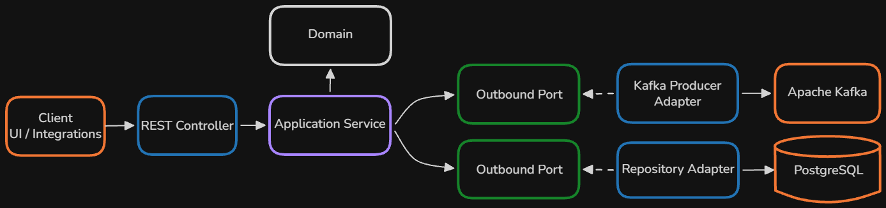

# Warehouse Goods Receiving Service

[](https://github.com/kamen-kamen/Receiving-Service/actions/workflows/ci.yaml)

Backend service for warehouse goods receiving. 
It manages ASN processing, worker receiving sessions, barcode scanning, discrepancy detection, and asynchronous communication with downstream warehouse services.

## Workflow

<p align="center">
  
</p>

## Architecture

The receiving process contains the most complex business rules and state transitions in the system. It follows a Ports & Adapters architecture to keep the domain independent from infrastructure.
The diagram below illustrates the architecture of this module.
Supporting modules interact directly with JPA repositories where additional abstraction provides little benefit.

<p align="center">
  
</p>


### Notable implementation details:

- **Redis-backed idempotency**: Prevents duplicate processing of state-changing requests using the `X-Idempotency-Key` header.
- **Error handling**: Standardized RFC 9457 Problem Details responses with domain-specific error codes and contextual error details.

## Tech Stack

**Core**
- Java 25
- Spring Boot 4
- Hibernate / JPA

**Infrastructure**
- PostgreSQL
- Redis
- Apache Kafka

**Security**
- Spring Security + JWT

**Testing & Quality**
- JUnit
- Mockito
- Testcontainers

**Tooling**
- Flyway
- Docker / Docker Compose
- GitHub Actions

## Getting Started

### Prerequisites

- **JDK 25**
- **Docker**

### Configuration Setup

Clone the repository and prepare the application environment file:

```sh
cp .env.example .env
```

Key configuration variables:
- `JWT_SECRET`: Secret key for JWT token signing.
- `JWT_ACCESS_TOKEN_EXPIRATION`, `JWT_REFRESH_TOKEN_EXPIRATION` - Token expiration time in milliseconds.
- `DB_NAME`, `DB_USER`, `DB_PASSWORD`: PostgreSQL connection credentials.
- `KAFKA_BOOTSTRAP_SERVERS`: Kafka bootstrap address (`kafka:9092` inside Docker, `localhost:9092` externally).
- `CORS_ALLOWED_ORIGINS`, etc.: CORS settings

### Running the Application
**Start Infrastructure & Service with Docker Compose:**

   ```sh
   docker compose up --build
   ```

## API Overview

Interactive API documentation and schema specifications are exposed via Swagger UI upon application launch:

**Swagger UI Endpoint**: `http://localhost:8080/swagger-ui/index.html`

> Note: click Authorize and pass JWT token from login endpoint to pin it to all requests automatically.

## Testing

Execute unit tests:

```sh
./mvnw clean test
```

Execute the full test suite:

```sh
./mvnw clean verify
```


## Project Structure 

```
src/main/java/com/waregang/receiving_service/
├── advanced_shipping_notice/       # ASN managing
│   ├── api/
│   ├── application/
│   ├── domain/
│   └── infrastructure/
├── receiving_process/              # Core goods receiving execution engine
│   ├── api/
│   ├── application/
│   │   └── ports/
│   ├── domain/
│   └── infrastructure/
├── integration/                    # Event-driven external system integrations
├── security/                       # Security configuration, JWT authentication, user management
└── common/                         # Cross-cutting concerns (idempotency interceptors, global exception handling, custom validation annotations, app-side UUID generation)
```

## Next Steps

- **Microservices**: Split the system into Auth and Receiving services, add simple implementation of Placement service.
- **Observability**: Try out Micrometer, Prometheus, Grafana, and OpenTelemetry.
- **Outbox pattern**: Implement the Transactional Outbox pattern with Debezium for reliable Kafka event publishing.
