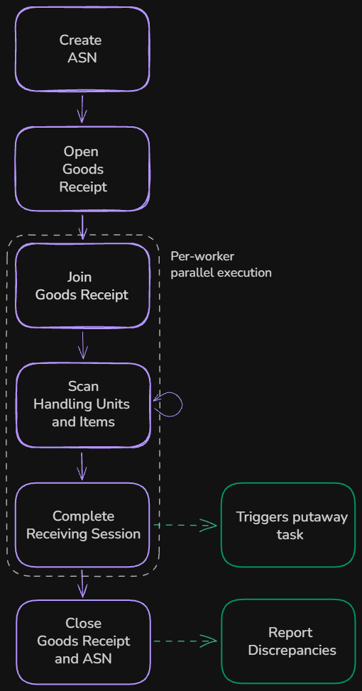
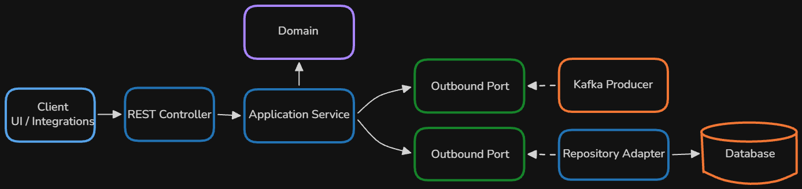

# Receiving Service

[](https://github.com/kamen-kamen/Receiving-Service/actions/workflows/ci.yaml)

Backend service for warehouse goods receiving: verifies scanned items against incoming shipments (ASN), reports discrepancies, and triggers putaway once a handling unit is fully received.

## Purpose of project

To get hands-on experience, encounter complexity and problems to solve and as a result grow. Sandbox to try out different interesting things.

## Workflow


<p align="center">
  
</p>

## Architecture

<p align="center">
  
</p>

A few implementation details worth noting:

- **Idempotency Layer**: Prevent duplicate POST operations for 100% guarantee of idempotency (X-Idempotency-Key header stored in Redis). 
- **Error handling**: Standardized (Problem Details) global exception handling with domain-specific error codes (`AsnErrorCode`, `ReceivingErrorCode`, `DatabaseErrorCode`) and a fluent `AppException` API for attaching context (`AppException.of(RECEIPT_NOT_FOUND).with("receipt_id", receipt.id())`).

## Tech Stack

Java 25, Spring Boot 4, PostgreSQL, Apache Kafka, Apache Maven, Redis

## Getting Started

### Prerequisites

- **JDK 25**
- **Docker**

### Environment Variables

Key configuration variables are in `.env`(copy from .env.example):
- `JWT_SECRET`: Secret key for JWT token signing.
- `JWT_ACCESS_TOKEN_EXPIRATION`, `JWT_REFRESH_TOKEN_EXPIRATION` - Token expiration time  in milliseconds.
- `DB_NAME`, `DB_USER`, `DB_PASSWORD`: PostgreSQL connection credentials.
- `KAFKA_BOOTSTRAP_SERVERS`: Kafka bootstrap address (`kafka:9092` inside Docker, `localhost:9092` externally).

### Running the Application
**Start Infrastructure & Service with Docker Compose:**
   ```sh
   docker compose up --build
   ```

   This will spin up the following containers:
   - **PostgreSQL** (`5432`) - Relational database for domain persistence and idempotency store.
   - **Apache Kafka** (`9092` / `9093`, KRaft mode) - Event broker for putaway tasks and discrepancy events.
   - **Redis** (`6379`) - Idempotency control layer.
   - **Receiving Service** (`8080`) - Spring Boot backend application.


## Swagger: API Overview 

List of endpoints and request/response schemas: `http://localhost:8080/swagger-ui/index.html`
Pass access JWT token from login endpoint in Authorize to automatically send token with requests.

## Project Structure 

```
src/main/java/com/waregang/receiving_service/
├── advanced_shipping_notice/       ### ASN domain (ASNs, expected handling units, contents, arrival timelines)
│   ├── api/                        # REST Controllers & DTOs for managing ASNs
│   ├── application/                # Application services & mapping logic
│   ├── domain/                     # Domain models (AdvancedShippingNotice, HandlingUnit, Content)
│   └── infrastructure/             # Database adapters & JPA repositories
├── receiving_process/              ### Core goods receiving execution engine
│   ├── api/                        # Scanning endpoints, receiving session controllers & DTOs
│   ├── application/                # Receiving process and Goods Receipt services 
│   ├── domain/                     # Domain models (GoodsReceipt, WorkerReceivingSession, ReceivedUnit)
│   └── infrastructure/             # Persistence adapters & JPA repositories
├── integration/                    ### Event-driven external system integrations
│   ├── discrepancies_report/       # Kafka adapter and service for discrepancy reports
│   └── putaway/                    # Kafka adapter and service for putaway notifying
├── security/                       ### Security configuration, JWT authentication, user management
└── common/                         ### Cross-cutting concerns (idempotency interceptors, global exception handling, custom validation annotations, app-side UUID generation)
```

## Next Steps

- **Microservices**: Split the system into Auth and Receiving services, add simple implementation of Placement services.
- **Observability**: Try out Micrometer, Prometheus, Grafana, and OpenTelemetry.
- **Outbox pattern**: Implement the Transactional Outbox pattern with Debezium for reliable Kafka event publishing.
